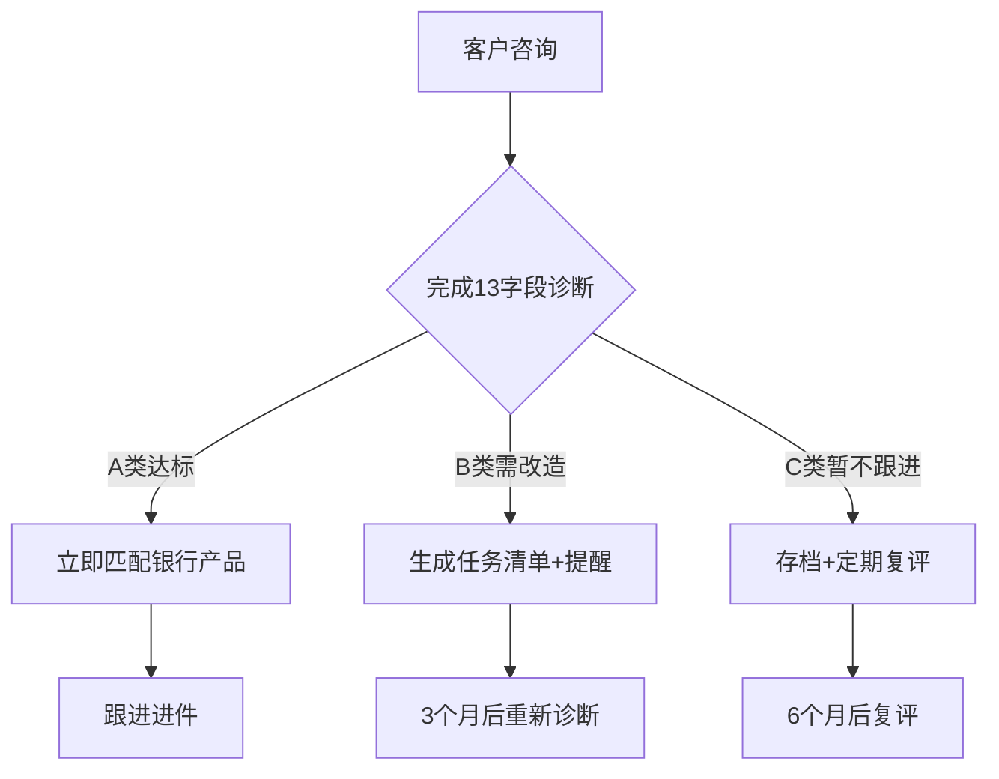

# 贷款中介业务基座 - 产品需求文档（V0版）

**文档版本**：v1.0  
**创建日期**：2026-01-27  
**责任人**：产品团队  
**审核人**：开发团队  
**状态**：待评审  
**参考**：00_核心文档/贷款中介业务基座-总纲-v1.1.md

---

## 文档说明

本文档定义贷款中介业务基座V0版本（最小可用版本）的产品需求。

**V0目标**：
- 2周完成14项P0功能
- 3个中介试点验证产品价值
- 为后续收费版本积累数据和案例

**适用范围**：V0阶段（2周开发期）  
**不适用**：V1规划、外部对接、移动端适配

---

## 1. 产品概述

### 1.1 产品愿景

**为什么做**：
帮助贷款中介复活存量客户，提升业务效率，实现：
- 存量复活：将B/C类客户通过改造升级为A类
- 精准匹配：准确匹配客户与银行产品（减少拒贷）
- 长期陪跑：跟踪改造进度，形成长期服务关系

**V0商业目标**：
- 3个中介试点，验证产品价值
- 单个中介能独立完成客户诊断和方案生成
- 生成至少3个实际执行的改造方案

**北极星指标**：
生成的改造方案被中介实际采用的数量

### 1.2 核心价值主张

**解决中介三大困境**：
1. **存量睡眠**：100-200个历史客户无法有效管理
2. **诊断低效**：依赖人工经验，准确率不足
3. **方案空泛**：只有建议，没有可执行任务清单

**我们的解决方案**：
1. **批量导入**：Excel导入历史客户数据
2. **自动分层**：六宫格体质评分 → A/B/C三类
3. **任务化方案**：缺口→任务清单→证据要求→到期提醒
4. **闭环复评**：30/60/90天自动重新评估

### 1.3 成功指标

**北极星指标**：
- 生成的改造方案被中介实际采用的数量

**关键指标**：
- 14项功能全部可用（验收通过）
- 3个中介愿意持续使用（留存）
- 生成的方案有实际执行案例（≥3个）

**观察指标**：
- 批量导入成功率（目标>90%）
- 产品匹配有结果率（目标>80%）
- 方案生成完成率（目标100%）

---

## 2. 用户分析

### 2.1 用户角色（V0版本）

**主要角色：中介公司管理员**  
- **人员**：小型中介（1-5人）的负责人  
- **权限**：管理本公司所有客户数据  
- **核心场景**：  
  1. 批量导入客户信息（Excel包含13个字段）
  2. 查看诊断结果（A/B/C分层+评分明细）
  3. 生成改造方案（任务清单+推荐服务商）
  4. 导出数据和报告（Excel/PDF）

**次要角色：系统管理员（内部）**  
- **人员**：Anthropic产品团队  
- **权限**：管理所有租户、查看审计日志  
- **操作**：开通中介账号、配置白标信息

**V1规划（不在V0范围）**：  
- 角色权限管理（管理员/业务员/只读）
- 客户分配机制
- 团队协作功能

### 2.2 用户旅程地图

### 2.3 核心业务流程

**流程1：新客户诊断**
1. 中介收集客户信息（13个必填字段）
2. 批量导入系统（Excel上传）
3. 系统自动诊断分层
   - 字段验证（13个字段完整性检查）
   - 六宫格评分（流水/票税/征信/资产/资质/行业）
   - A/B/C分层（总分≥600/A类，400-600/B类，<400/C类）
4. 查看诊断结果
   - A类：直接推荐产品
   - B类：进入改造流程
   - C类：暂不跟进

**流程2：B类客户改造**
1. 系统识别缺口
   - 对比目标产品准入条件
   - 找出差距（流水不足/征信问题等）
2. 匹配改造方案
   - 从12个方案中匹配
   - 推荐2-3个可行方案
3. 生成改造计划
   - 缺口清单
   - 任务清单（做什么+谁负责+证据要求+完成标准）
   - 服务商推荐（可选）
   - ROI计算（改造成本vs贷款增量）
4. 导出PDF方案
   - 给客户展示
   - 推荐服务商

---

## 3. V0功能需求（2周交付）
> 详细功能规格来源：00_核心文档/贷款中介业务基座-总纲-v1.1.md 第十节

### 3.1 合规底座（4项功能）

#### 功能1：委托处理协议模板
- **功能描述**：生成带免责声明的PDF协议
- **输入**：中介公司名称、日期
- **输出**：PDF文件（含固定免责声明）
- **验收标准**：能生成、能下载、免责声明不可删除

#### 功能2：租户隔离+操作留痕
- **功能描述**：不同中介数据完全隔离，所有操作可追溯
- **实现**：所有表带tenant_id，中间件自动过滤，审计日志记录
- **验收标准**：登录中介A只能看A的数据，所有操作有日志

#### 功能3：数据导出/删除机制
- **功能描述**：租户可导出所有数据，可删除所有数据
- **实现**：Excel导出、软删除+30天冷却期、二次确认
- **验收标准**：能导出、能删除、有确认步骤、可恢复

#### 功能4：免责声明（固化）
- **功能描述**：所有报告自动带免责声明，无法删除
- **实现**：固化在代码常量中
- **验收标准**：报告必带声明、不可修改、不可删除

### 3.2 业务功能（6项功能）

#### 功能5：批量导入Excel
- **功能描述**：上传包含客户信息的Excel，批量导入系统
- **输入**：xlsx文件，包含13个必填字段（企业名称、注册资本、成立时间、法人姓名、年开票、年纳税、对公流水、法人征信、企业征信、主营业务、行业、贷款需求）
- **处理**：字段验证、格式校验、批量插入
- **输出**：成功/失败统计、详细错误列表
- **验收标准**：100条数据3-5秒完成、错误信息清晰

#### 功能6：自动诊断分层
- **功能描述**：根据六宫格体质评分，自动分为A/B/C三类
- **算法**：
  - 流水体质（200分）
  - 票税体质（200分）
  - 征信体质（200分）
  - 资产体质（150分）
  - 资质体质（150分）
  - 行业体质（100分）
- **分层规则**：
  - A类（总分≥600）：现在能贷
  - B类（400≤总分<600）：值得改造
  - C类（总分<400）：暂不跟进
- **输出**：分层结果、评分明细、分层理由
- **验收标准**：分层准确、有评分明细、可解释

#### 功能7：三段式输出
- **功能描述**：根据不同分层输出对应的建议方案
- **输入**：分层结果（A/B/C）
- **输出**：
  - A类：产品匹配清单+预估额度
  - B类：改造方案包（任务清单+服务商推荐）
  - C类：暂不建议申请+原因说明
- **验收标准**：三类输出格式正确、带免责声明

#### 功能8：改造方案生成
- **功能描述**：生成结构化改造方案包
- **输入**：客户缺口数据
- **输出**：含5个标准部分的方案包：
  1. 缺口清单（差什么、差多少）
  2. 任务清单（做什么、谁负责、证据要求、完成标准）
  3. 推荐服务商（2-3家可选，或中介自己找）
  4. 效果预览（改造后预计能贷多少）⚠️ 以银行审批为准
  5. 成本估算（改造成本、ROI）
- **验收标准**：方案结构完整、可执行、有免责声明

#### 功能9：自动提醒
- **功能描述**：根据不同客户类型设置自动提醒
- **触发条件**：
  - A类：立即提醒（可跟进进件）
  - B类：到期提醒（3个月改造期到期）
  - C类：定期复评提醒（6个月后）
- **输出**：系统内提醒+邮件/微信通知
- **验收标准**：按时触发提醒、通知准确

#### 功能10：可解释+人工复核
- **功能描述**：提供可解释结果并支持人工复核
- **算法护栏**：
  1. 可解释：每个分层都能说清楚为什么（基于哪些字段、哪些规则）
  2. 人工复核：中介可以改判系统的分层（A→B或B→A）
  3. 学习闭环：系统记录人工修正理由，用于后续优化
- **验收标准**：分层理由清晰、支持人工修正、保留修正记录

### 3.3 白标配置（2项功能）

#### 功能11：Logo/域名配置
- **功能描述**：自定义品牌元素
- **可配置项**：
  - Logo上传与替换
  - 主色调选择
  - 自定义域名（子域名）
  - 公司名称、联系方式
- **验收标准**：配置实时生效、界面风格统一

#### 功能12：产品/方案库开关
- **功能描述**：启用/禁用银行产品和改造方案
- **输入**：产品/方案开关状态
- **输出**：更新后的产品库/方案库展示
- **验收标准**：开关即时生效、停用产品不展示

### 3.4 分佣功能（2项功能）

#### 功能13：披露勾选（强制）
- **功能描述**：强制服务商返佣披露
- **实现**：
  - 推荐服务商时必须有返佣披露
  - 中介必须勾选"已了解返佣分配"
  - 企业主页面显示"可自选服务商"
- **验收标准**：未勾选无法继续、披露信息完整

#### 功能14：对账记录
- **功能描述**：记录返佣交易信息
- **字段**：订单号、金额、服务完成状态、返佣比例、分配记录
- **输出**：可追溯的对账记录
- **验收标准**：交易全程可追溯、分配记录清晰

---

## 4. 设计目标（非承诺性，待验证）

### 4.1 性能设计目标
| 指标 | 目标值 | 说明 |
|------|--------|------|
| **批量导入** | 100条数据≤5秒 | 设计目标，待实测验证 |
| **单次诊断** | ≤3秒 | 设计目标 |
| **并发用户** | 10个 | V0阶段支持能力 |
| **响应时间** | ≤2秒（API） | 普通操作响应目标 |

### 4.2 安全性设计
- **租户隔离**：物理或逻辑隔离，确保中介间数据不可见
- **操作留痕**：所有关键操作记录审计日志（保留1年）
- **权限控制**：V0仅支持中介管理员单一角色
- **数据加密**：传输层TLS，存储层SQLite基础加密

### 4.3 可用性设计
- **部署方式**：本地部署（中介自托管）
- **故障恢复**：手动重启 + 每日自动数据备份
- **监控能力**：基础健康检查 + 错误日志
- **维护窗口**：支持计划内维护停机

---

## 5. 业务规则

### 5.1 诊断规则
**六宫格体质评分模型**：
| 体质维度 | 核心指标 | 满分 | 权重说明 |
|---------|---------|------|----------|
| 流水体质 | 对公流水规模、稳定性 | 200分 | 银行最看重连续现金流 |
| 票税体质 | 年开票额、年纳税额 | 200分 | 税贷/发票贷核心依据 |
| 征信体质 | 查询次数、负债结构 | 200分 | 一票否决项（严重逾期） |
| 资产体质 | 抵押物价值、保证人 | 150分 | 增信手段，非必需 |
| 资质体质 | 高新/专精特新认定 | 150分 | 政策优惠项 |
| 行业体质 | 行业风险、政策支持 | 100分 | 负面筛查维度 |

**分层阈值**：
- A类（立即可贷）：总分≥600分
- B类（值得改造）：400分≤总分<600分
- C类（暂不跟进）：总分<400分

### 5.2 匹配规则
**产品匹配逻辑**：
1. 遍历20个银行产品准入条件
2. 逐条对比客户条件
3. 识别具体差距（数值型差距需量化）
4. 输出匹配结果+差距清单

**改造方案匹配**：
- 从12个标准方案库中匹配
- 基于具体差距类型（如开票不足→开票提升术）
- 推荐2-3个可行性方案

### 5.3 合规规则
**禁用表述**：
- ❌ "低息快贷"
- ❌ "无条件放款"
- ❌ "百分百放款"
- ❌ "内部渠道"

**统一措辞**：
- ✅ "初步评估/预估/建议"
- ✅ "以银行审批为准"
- ✅ "仅供参考"
- ✅ "改造后预计可贷"

---

## 6. 技术约束

### 6.1 技术栈要求
**后端**：
- 框架：FastAPI（Python）
- 数据库：SQLite（V0简化版）
- 文件存储：本地文件系统

**前端**：
- 框架：React + TypeScript
- UI库：Ant Design
- 打包：Vite

**部署**：
- 方式：本地部署（中介自行安装）
- 环境：Windows/Linux均可
- 依赖：Python 3.9+，Node.js 18+

### 6.2 数据模型约束
**最小数据集**：13个必填字段
**数据隔离**：租户ID贯穿所有表
**审计日志**：操作日志表（user_id, action, timestamp, details）
**版本管理**：客户档案支持多版本材料存储

### 6.3 接口约束
**API设计原则**：
- RESTful风格
- 统一错误响应格式
- 请求频率限制（防刷）
- 接口文档自动生成

---

## 7. 开发计划

### 7.1 V0里程碑（2周）
**第一周**：
- Day 1-3：合规底座（4项功能）
- Day 4-5：批量导入+诊断分层（功能5-6）
- Day 6-7：方案生成+提醒（功能7-9）

**第二周**：
- Day 8-9：白标配置（功能11-12）
- Day 10-11：分佣功能（功能13-14）
- Day 12-13：集成测试
- Day 14：部署文档+验收准备

### 7.2 验收标准
**功能验收**：
- 14项功能全部可用
- 各功能输入输出符合规格
- 性能达到设计目标

**集成验收**：
- 端到端流程可执行
- 数据流完整不中断
- 错误处理完善

**可用性验收**：
- 3个中介完成测试用例
- 关键操作≤3次点击完成
- 界面响应≤2秒

### 7.3 发布计划
**发布范围**：
- 3个中介试点
- 本地部署版本
- 完整文档+安装指南

**验证周期**：
- 第一周：功能验收
- 第二周：用户可用性测试
- 第三周：问题修复+迭代

---

## 8. 风险与依赖

### 8.1 技术风险
**主要风险**：
1. **实习生+AI开发模式**：经验不足可能导致返工
2. **SQLite性能限制**：数据量大时可能需迁移
3. **本地部署复杂度**：中介IT能力参差不齐

**缓解措施**：
- 每日代码审查
- 性能监控+预警
- 简化安装包（一键安装）

### 8.2 业务风险
**主要风险**：
1. **3个中介未找到**：验证环境不足
2. **改造方案执行率低**：中介不实际使用
3. **返佣披露接受度低**：中介抵触透明化

**缓解措施**：
- 预备5个备选中介
- 设计激励方案（前3个月免费）
- 明确价值主张（合规+效率）

### 8.3 依赖项
**技术依赖**：
- Claude Code：AI辅助开发
- 现有知识库：银行政策库+改造方案库
- 开源组件：FastAPI、React、Ant Design

**业务依赖**：
- 总纲v1.1：战略指导
- 开发团队：2周时间承诺
- 中介合作意愿

---

## 附录

### A. 参考文档
1. **战略文档**：00_核心文档/贷款中介业务基座-总纲-v1.1.md
2. **业务知识**：01_银行政策库/产品总表.md
3. **改造方案**：02_改造方案库/方案总表.md
4. **诊断逻辑**：03_诊断工具/诊断逻辑说明.md
5. **开发计划**：05_开发文档/Phase2-V0开发启动清单.md
6. **技术架构**：05_开发文档/技术栈选择.md

### B. 术语表
- **存量客户**：中介已有的历史客户（未成交或已成交）
- **六宫格体质**：流水/票税/征信/资产/资质/行业六个评估维度
- **A/B/C分层**：立即可贷/值得改造/暂不跟进三类客户
- **改造方案**：结构化任务清单+证据要求+服务商推荐
- **白标配置**：品牌自定义（Logo、颜色、域名）

### C. 变更记录
| 版本 | 日期 | 变更说明 | 责任人 |
|------|------|----------|--------|
| v1.0 | 2026-01-27 | 初始版本，基于总纲v1.1重构 | 产品团队 |